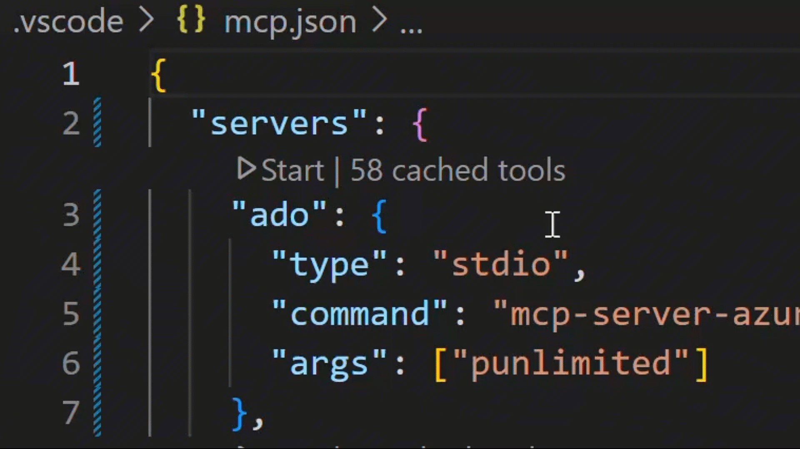

# ⭐ Azure DevOps MCP Server

Easily install the Azure DevOps MCP Server for VS Code or VS Code Insiders:

[](https://insiders.vscode.dev/redirect/mcp/install?name=ado&config=%7B%20%22type%22%3A%20%22stdio%22%2C%20%22command%22%3A%20%22npx%22%2C%20%22args%22%3A%20%5B%22-y%22%2C%20%22%40azure-devops%2Fmcp%22%2C%20%22%24%7Binput%3Aado_org%7D%22%5D%7D&inputs=%5B%7B%22id%22%3A%20%22ado_org%22%2C%20%22type%22%3A%20%22promptString%22%2C%20%22description%22%3A%20%22Azure%20DevOps%20organization%20name%20%20%28e.g.%20%27contoso%27%29%22%7D%5D)
[](https://insiders.vscode.dev/redirect/mcp/install?name=ado&quality=insiders&config=%7B%20%22type%22%3A%20%22stdio%22%2C%20%22command%22%3A%20%22npx%22%2C%20%22args%22%3A%20%5B%22-y%22%2C%20%22%40azure-devops%2Fmcp%22%2C%20%22%24%7Binput%3Aado_org%7D%22%5D%7D&inputs=%5B%7B%22id%22%3A%20%22ado_org%22%2C%20%22type%22%3A%20%22promptString%22%2C%20%22description%22%3A%20%22Azure%20DevOps%20organization%20name%20%20%28e.g.%20%27contoso%27%29%22%7D%5D)

This TypeScript project provides a **local** MCP server for Azure DevOps, enabling you to perform a wide range of Azure DevOps tasks directly from your code editor.

## 📄 Table of Contents

1. [📺 Overview](#-overview)
2. [🏆 Expectations](#-expectations)
3. [⚙️ Supported Tools](#️-supported-tools)
4. [🔌 Installation & Getting Started](#-installation--getting-started)
5. [🌏 Using Domains](#-using-domains)
6. [📝 Troubleshooting](#-troubleshooting)
7. [🎩 Examples & Best Practices](#-examples--best-practices)
8. [🙋‍♀️ Frequently Asked Questions](#️-frequently-asked-questions)
9. [📌 Contributing](#-contributing)

## 📺 Overview

The Azure DevOps MCP Server brings Azure DevOps context to your agents. Try prompts like:

- "List my ADO projects"
- "List ADO Builds for 'Contoso'"
- "List ADO Repos for 'Contoso'"
- "List test plans for 'Contoso'"
- "List teams for project 'Contoso'"
- "List iterations for project 'Contoso'"
- "List my work items for project 'Contoso'"
- "List work items in current iteration for 'Contoso' project and 'Contoso Team'"
- "List all wikis in the 'Contoso' project"
- "Create a wiki page '/Architecture/Overview' with content about system design"
- "Update the wiki page '/Getting Started' with new onboarding instructions"
- "Get the content of the wiki page '/API/Authentication' from the Documentation wiki"

## 🏆 Expectations

The Azure DevOps MCP Server is built from tools that are concise, simple, focused, and easy to use—each designed for a specific scenario. We intentionally avoid complex tools that try to do too much. The goal is to provide a thin abstraction layer over the REST APIs, making data access straightforward and letting the language model handle complex reasoning.

## ⚙️ Supported Tools

See [TOOLSET.md](./docs/TOOLSET.md) for a comprehensive list.

## 🔌 Installation & Getting Started

For the best experience, use Visual Studio Code and GitHub Copilot. See the [getting started documentation](./docs/GETTINGSTARTED.md) to use our MCP Server with other tools such as Visual Studio 2022, Claude Code, and Cursor.

### Prerequisites

1. Install [VS Code](https://code.visualstudio.com/download) or [VS Code Insiders](https://code.visualstudio.com/insiders)
2. Install [Node.js](https://nodejs.org/en/download) 20+
3. Open VS Code in an empty folder

### Installation

#### ✨ One-Click Install

[](https://insiders.vscode.dev/redirect/mcp/install?name=ado&config=%7B%20%22type%22%3A%20%22stdio%22%2C%20%22command%22%3A%20%22npx%22%2C%20%22args%22%3A%20%5B%22-y%22%2C%20%22%40azure-devops%2Fmcp%22%2C%20%22%24%7Binput%3Aado_org%7D%22%5D%7D&inputs=%5B%7B%22id%22%3A%20%22ado_org%22%2C%20%22type%22%3A%20%22promptString%22%2C%20%22description%22%3A%20%22Azure%20DevOps%20organization%20name%20%20%28e.g.%20%27contoso%27%29%22%7D%5D)
[](https://insiders.vscode.dev/redirect/mcp/install?name=ado&quality=insiders&config=%7B%20%22type%22%3A%20%22stdio%22%2C%20%22command%22%3A%20%22npx%22%2C%20%22args%22%3A%20%5B%22-y%22%2C%20%22%40azure-devops%2Fmcp%22%2C%20%22%24%7Binput%3Aado_org%7D%22%5D%7D&inputs=%5B%7B%22id%22%3A%20%22ado_org%22%2C%20%22type%22%3A%20%22promptString%22%2C%20%22description%22%3A%20%22Azure%20DevOps%20organization%20name%20%20%28e.g.%20%27contoso%27%29%22%7D%5D)

After installation, select GitHub Copilot Agent Mode and refresh the tools list. Learn more about Agent Mode in the [VS Code Documentation](https://code.visualstudio.com/docs/copilot/chat/chat-agent-mode).

#### 🧨 Install from Public Feed (Recommended)

This installation method is the easiest for all users of Visual Studio Code.

🎥 [Watch this quick start video to get up and running in under two minutes!](https://youtu.be/EUmFM6qXoYk)

##### Steps

In your project, add a `.vscode\mcp.json` file with the following content:

```json
{
  "inputs": [
    {
      "id": "ado_org",
      "type": "promptString",
      "description": "Azure DevOps organization name  (e.g. 'contoso')"
    }
  ],
  "servers": {
    "ado": {
      "type": "stdio",
      "command": "npx",
      "args": ["-y", "@azure-devops/mcp", "${input:ado_org}"]
    }
  }
}
```

🔥 To stay up to date with the latest features, you can use our nightly builds. Simply update your `mcp.json` configuration to use `@azure-devops/mcp@next`. Here is an updated example:

```json
{
  "inputs": [
    {
      "id": "ado_org",
      "type": "promptString",
      "description": "Azure DevOps organization name  (e.g. 'contoso')"
    }
  ],
  "servers": {
    "ado": {
      "type": "stdio",
      "command": "npx",
      "args": ["-y", "@azure-devops/mcp@next", "${input:ado_org}"]
    }
  }
}
```

Save the file, then click 'Start'.



In chat, switch to [Agent Mode](https://code.visualstudio.com/blogs/2025/02/24/introducing-copilot-agent-mode).

Click "Select Tools" and choose the available tools.


Open GitHub Copilot Chat and try a prompt like `List ADO projects`. The first time an ADO tool is executed browser will open prompting to login with your Microsoft account. Please ensure you are using credentials matching selected Azure DevOps organization.

> 💥 We strongly recommend creating a `.github\copilot-instructions.md` in your project. This will enhance your experience using the Azure DevOps MCP Server with GitHub Copilot Chat.
> To start, just include "`This project uses Azure DevOps. Always check to see if the Azure DevOps MCP server has a tool relevant to the user's request`" in your copilot instructions file.

See the [getting started documentation](./docs/GETTINGSTARTED.md) to use our MCP Server with other tools such as Visual Studio 2022, Claude Code, and Cursor.

## 🛠️ 開發環境設定 (Development Setup)

如果你正在開發或修改此 MCP Server，需要使用本地編譯的版本進行測試，請依照以下步驟設定：

### 1. 編譯專案

```bash
npm install
npm run build
```

### 2. 設定 mcp.json (本地開發版)

在你的專案中建立 `.vscode/mcp.json`，使用 `node` 直接執行編譯後的 `dist/index.js`：

```json
{
  "servers": {
    "tmc-devops-mcp-dev": {
      "type": "stdio",
      "command": "node",
      "args": [
        "/path/to/tmc-devops-mcp/dist/index.js",
        "你的organization名稱"
      ],
      "env": {
        "LOG_LEVEL": "debug"
      }
    }
  }
}
```

> ⚠️ **注意**：請將 `/path/to/tmc-devops-mcp/` 替換為你實際的專案絕對路徑，並將 `你的organization名稱` 替換為實際的 Azure DevOps organization 名稱。

### 3. 使用 Watch 模式開發

開發時可以開啟 TypeScript watch 模式，自動重新編譯：

```bash
npm run watch
```

每次修改程式碼後，只需在 VS Code 中重新啟動 MCP Server 即可測試新的變更。

### 4. 使用 MCP Inspector 調試

專案內建 MCP Inspector 支援，可以用來檢視工具定義和測試：

```bash
npm run inspect
```

這會啟動一個可視化介面，讓你可以直接測試各個工具的輸入輸出。


## 🌏 Using Domains

Azure DevOps exposes a large surface area. As a result, our Azure DevOps MCP Server includes many tools. To keep the toolset manageable, avoid confusing the model, and respect client limits on loaded tools, use Domains to load only the areas you need. Domains are named groups of related tools (for example: core, work, work-items, repositories, wiki). Add the `-d` argument and the domain names to the server args in your `mcp.json` to list the domains to enable.

For example, use `"-d", "core", "work", "work-items"` to load only Work Item related tools (see the example below).

```json
{
  "inputs": [
    {
      "id": "ado_org",
      "type": "promptString",
      "description": "Azure DevOps organization name  (e.g. 'contoso')"
    }
  ],
  "servers": {
    "ado_with_filtered_domains": {
      "type": "stdio",
      "command": "npx",
      "args": ["-y", "@azure-devops/mcp", "${input:ado_org}", "-d", "core", "work", "work-items"]
    }
  }
}
```

Domains that are available are: `core`, `work`, `work-items`, `search`, `test-plans`, `repositories`, `wiki`, `pipelines`, `advanced-security`

We recommend that you always enable `core` tools so that you can fetch project level information.

> By default all domains are loaded

## 📝 Troubleshooting

See the [Troubleshooting guide](./docs/TROUBLESHOOTING.md) for help with common issues and logging.

## 🎩 Examples & Best Practices

Explore example prompts in our [Examples documentation](./docs/EXAMPLES.md).

For best practices and tips to enhance your experience with the MCP Server, refer to the [How-To guide](./docs/HOWTO.md).

## 🙋‍♀️ Frequently Asked Questions

For answers to common questions about the Azure DevOps MCP Server, see the [Frequently Asked Questions](./docs/FAQ.md).

## 📌 Contributing

We welcome contributions! During preview, please file issues for bugs, enhancements, or documentation improvements.

See our [Contributions Guide](./CONTRIBUTING.md) for:

- 🛠️ Development setup
- ✨ Adding new tools
- 📝 Code style & testing
- 🔄 Pull request process

> ⚠️ Please read the [Contributions Guide](./CONTRIBUTING.md) before creating a pull request.

## 🤝 Code of Conduct

This project follows the [Microsoft Open Source Code of Conduct](https://opensource.microsoft.com/codeofconduct/).
For questions, see the [FAQ](https://opensource.microsoft.com/codeofconduct/faq/) or contact [open@microsoft.com](mailto:open@microsoft.com).

## 📈 Project Stats

[](https://star-history.com/#microsoft/azure-devops-mcp)

## 🏆 Hall of Fame

Thanks to all contributors who make this project awesome! ❤️

[](https://github.com/microsoft/azure-devops-mcp/graphs/contributors)

> Generated with [contrib.rocks](https://contrib.rocks)

## License

Licensed under the [MIT License](./LICENSE.md).

---

_Trademarks: This project may include trademarks or logos for Microsoft or third parties. Use of Microsoft trademarks or logos must follow [Microsoft’s Trademark & Brand Guidelines](https://www.microsoft.com/en-us/legal/intellectualproperty/trademarks/usage/general). Third-party trademarks are subject to their respective policies._

<!-- version: 2023-04-07 [Do not delete this line, it is used for analytics that drive template improvements] -->


tmc-devops-mcp / wit_add_child_work_items

{
  "items": [
    {
      "description": "",
      "title": "sldkfjsldkfjsldfkj"
    }
  ],
  "parentId": 15,
  "project": "dev",
  "workItemType": "Task"
}